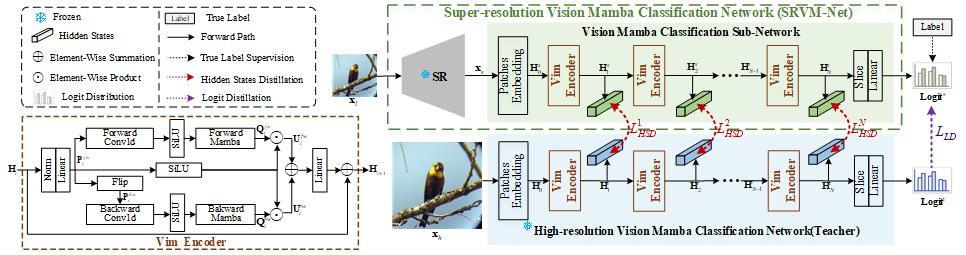

# <center>ViMD</center>
##<center>Vision Mamba Distillation for Low-resolution Fine-grained Image Classification</center>
## Abstarct
Low-resolution fine-grained image classification has
recently made significant progress, largely thanks to the super-resolution techniques and knowledge distillation methods. However, these approaches lead to an exponential increase in the number of parameters and computational complexity of models. In order to solve this problem, in this letter, we propose a Vision Mamba Distillation (ViMD) approach to enhance the effectiveness and efficiency of low-resolution fine-grained image classification. Concretely, a lightweight super-resolution vision Mamba classification network (SRVM-Net) is proposed to improve its capability for extracting visual features by redesigning the classification sub-network with Mamba modeling. Moreover, we design a
novel multi-level Mamba knowledge distillation loss boosting the performance, which can transfer prior knowledge obtained from a High-resolution Vision Mamba classification Network (HRVM-Net) as a teacher into the proposed SRVM-Net as a student. Extensive experiments on seven public fine-grained classification datasets related to benchmarks confirm our ViMD achieves a new state-of-the-art performance. While having higher accuracy, ViMD outperforms similar methods with fewer parameters and
FLOPs, which is more suitable for embedded device applications.

 

## Preparation
Download [pre-trained vim-tiny](https://huggingface.co/hustvl/Vim-tiny-midclstok) and untar them to ./Vim-tiny-midclstok.

## Configuration

###Python 3.10.3
> conda create -n env_name python=3.10.13

###torch 2.1.1 + cu118
> pip install torch==2.1.1 torchvision==0.16.1 torchaudio==2.1.1 --index-url https://download.pytorch.org/whl/cu118

###Requirements: requirements.txt
> pip install -r ./vimd/requirements.txt

###Install causal_conv1d and mamba
> wget [causal_conv1d](https://github.com/Dao-AILab/causal-conv1d/releases/download/v1.1.3.post1/causal_conv1d-1.1.3.post1+cu118torch2.1cxx11abiFALSE-cp310-cp310-linux_x86_64.whl)

> wget [mamba](https://github.com/state-spaces/mamba/releases/download/v1.1.1/mamba_ssm-1.1.1+cu118torch2.1cxx11abiFALSE-cp310-cp310-linux_x86_64.whl)

> pip install [causal_conv1d]()

>pip install [mamba]()


## Training
    
```sh
./scripts/train_teacher.sh
```
Please modify the model path in ./scripts/train_teacher.sh and ./vimd/train_teacher.py

```sh
./scripts/train_student.sh
```
Please modify the model path in ./scripts/train_student.sh and ./vimd/train_student.py

## Testing

```sh
./scripts/test.sh
```

## Acknowledge
This project is based on Mamba([paper](https://arxiv.org/abs/2312.00752), [code](https://github.com/state-spaces/mamba)) and Vision Mamba([paper](https://arxiv.org/pdf/2401.09417), [code](https://arxiv.org/pdf/2401.09417)).Thanks for their wonderful works!